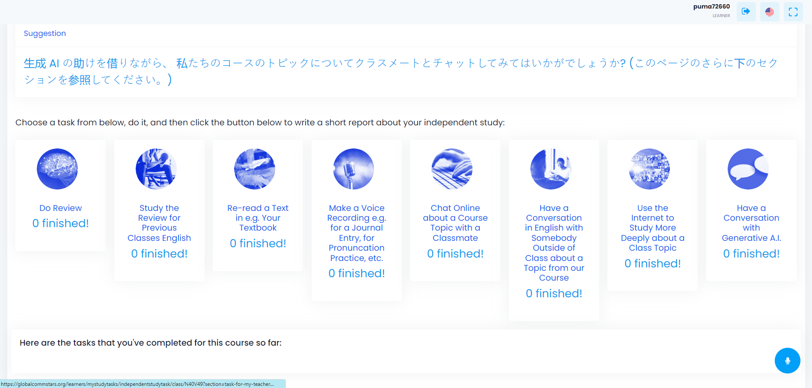

## Global Communication Stars

`04.2023 ~ 01.2024`

As the lead developer spearheading the evolution of our Learning Management System (LMS), I orchestrated a transformative journey to strengthen the connection between educators and students. The core objective was to create a dynamic platform facilitating seamless communication, assessment, and resource management.

- Teacher-Student Interaction:
  Established a robust framework for teachers and students to engage effectively. Through the LMS, teachers could effortlessly store test problems and receive insightful assessments of student performance.

- ChatGPT Integration for Test Problem Generation:
  Innovatively incorporated ChatGPT to dynamically generate test problems. This cutting-edge feature not only ensured diverse and challenging assessments but also showcased the system's adaptability and intelligence.

- Voice Recording and Assessment:
  Introduced a comprehensive voice recording functionality for students. The system provided detailed assessments on fluency, pronunciation, grammatical correctness, and syntax, offering personalized feedback for continuous improvement.

- Multi-Platform Accessibility:
  Engineered a Progressive Web App (PWA) that seamlessly operated across mobile phones, web browsers, and PCs. This versatile solution empowered users to access learning resources anytime, anywhere, and facilitated a consistent user experience across devices.

- Real-time Notifications:
  Implemented a sophisticated notification system, ensuring teachers and students received prompt updates whenever learning resources were pushed to their classes. This real-time feature enhanced engagement and facilitated timely interaction.

- Database Management:
  Undertook the responsibility of managing databases, optimizing data storage, retrieval, and ensuring the system's scalability. This meticulous approach contributed to a robust and efficient backend infrastructure.

**Achievement**

- Successfully transformed the LMS into a dynamic platform that fostered meaningful teacher-student interactions.
- Introduced AI-driven test problem generation, showcasing innovation and adaptability.
- Implemented a voice assessment feature, providing personalized feedback for language proficiency improvement.
- Developed a versatile PWA, ensuring a seamless user experience across various devices.
- Established a real-time notification system, enhancing communication and resource accessibility.

#### Category

`Laravel` `Web` `Education`

|                                     Technology                                      | Client |
| :---------------------------------------------------------------------------------: | :----: |
| Laravel, Google Analytics, HTML, JavaScript, CSS, Jquery, Tailwind CSS, OpenAI, SEO | Japan  |

| App |                 Link                 |
| :-: | :----------------------------------: |
| Web | [Link](https://globalcommstars.org/) |

|              Images               |
| :-------------------------------: |
|  |
|  |
|  |
