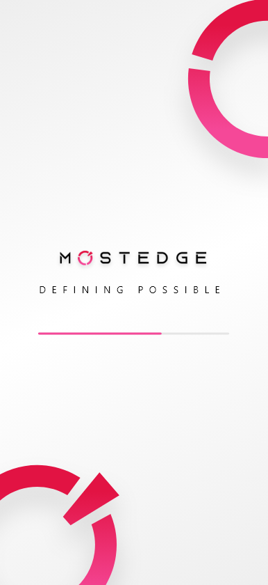
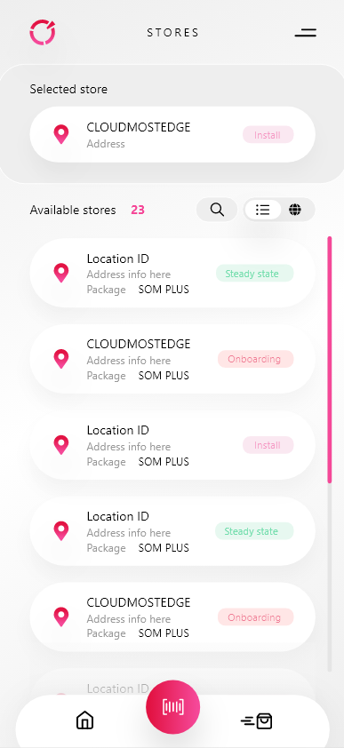
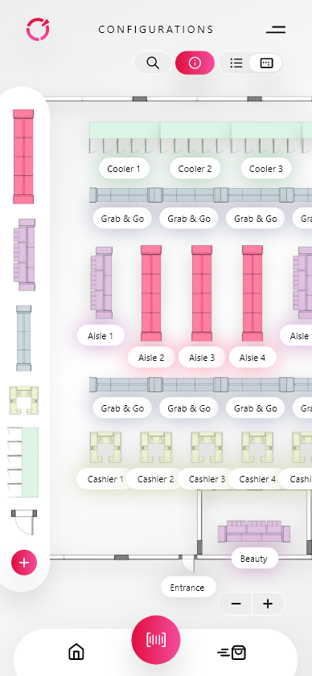
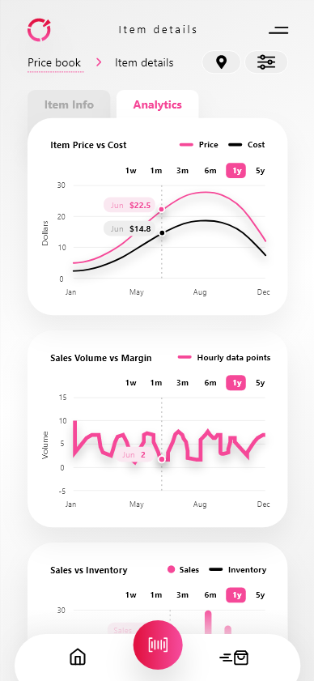
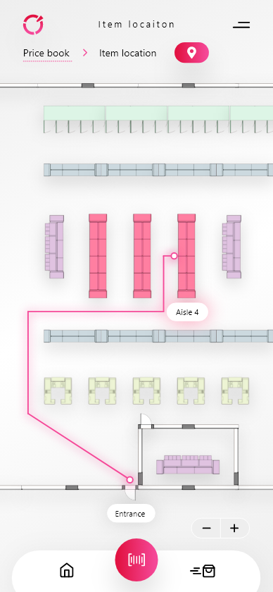

## Mostedge

`11.2022 ~ 11.2023`

MOSTEDGE represents a cutting-edge cloud-based mobile convenience store (c-store) back office product, revolutionizing the way store owners manage and monitor their business. This innovative app provides an unparalleled level of convenience, empowering store owners to stay connected with their operations seamlessly, anytime and anywhere.

At the core of MOSTEDGE is its ability to offer real-time insights into store transactions, allowing owners to monitor sales activities with unprecedented ease. Whether on the premises or on the move, this cloud-based solution ensures that critical transactional data is at the fingertips of store owners, fostering informed decision-making and efficient management.

The versatility of MOSTEDGE extends beyond transaction monitoring, enabling store owners to check comprehensive sales data effortlessly. From analyzing top-selling products to identifying emerging trends, this feature equips owners with valuable information to refine their inventory management and marketing strategies, ultimately contributing to increased profitability.

An exceptional aspect of MOSTEDGE is its dynamic functionality that enables store owners to update item prices remotely. This flexibility ensures that pricing adjustments can be made promptly in response to market fluctuations, promotions, or any other relevant factors. This real-time pricing capability not only enhances agility but also contributes to maintaining a competitive edge in the market.

Welcome to a whole new era of business management, where the MOSTEDGE app provides an on-the-go solution for store owners. The app's user-friendly interface and intuitive design make it an invaluable tool for those seeking to optimize their business operations efficiently. Whether at the store, at home, or while traveling, MOSTEDGE ensures that owners have constant access to crucial data and functionalities, fostering a seamless and connected approach to managing their c-store.

In essence, MOSTEDGE is not just an app; it is a game-changer for convenience store owners, ushering in a new paradigm of flexibility, accessibility, and control in the palm of their hands. Embrace the future of c-store management with MOSTEDGE – your business, reimagined on the go.

#### Category

`Ionic` `Angular` `Mobile` `iOS` `Android`

|                Technology                |    Client     |
| :--------------------------------------: | :-----------: |
| Ionic, Angular, iOS, Android, Capacitor, | United States |

|   App   |                                          Link                                          |
| :-----: | :------------------------------------------------------------------------------------: |
| android | https://play.google.com/store/apps/details?id=com.mostedge.mobile&hl=en_AU&gl=US&pli=1 |

|           Images           |
| :------------------------: |
|  |
|  |
|  |
|  |
|  |
