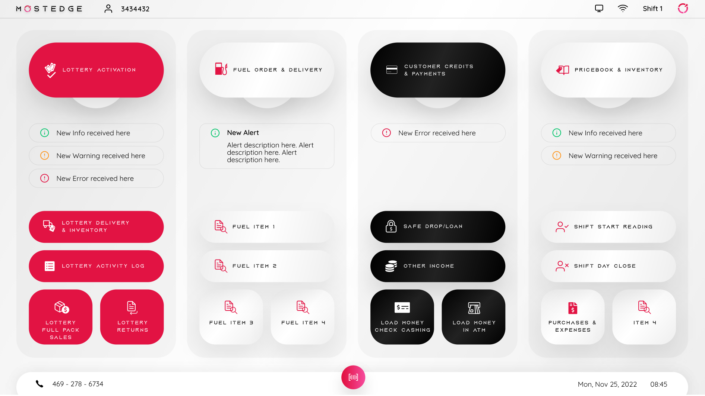
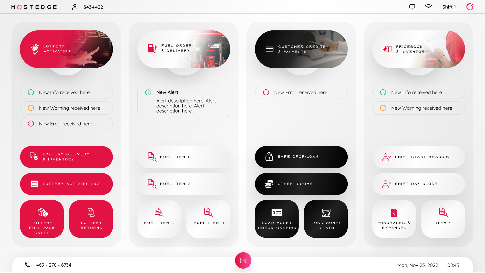
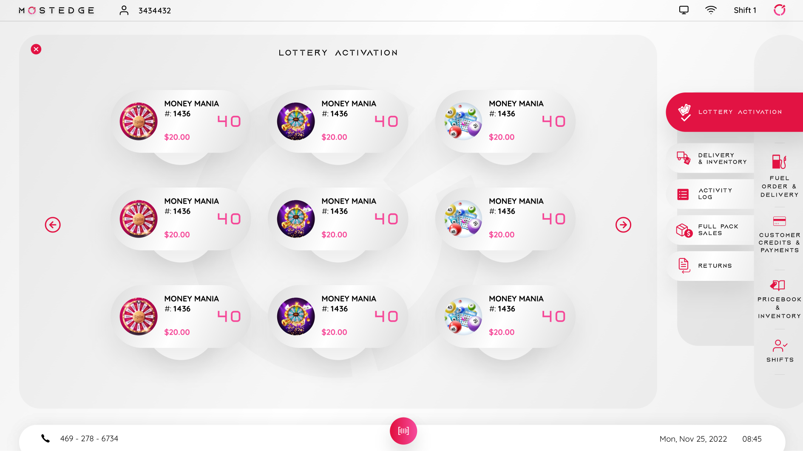
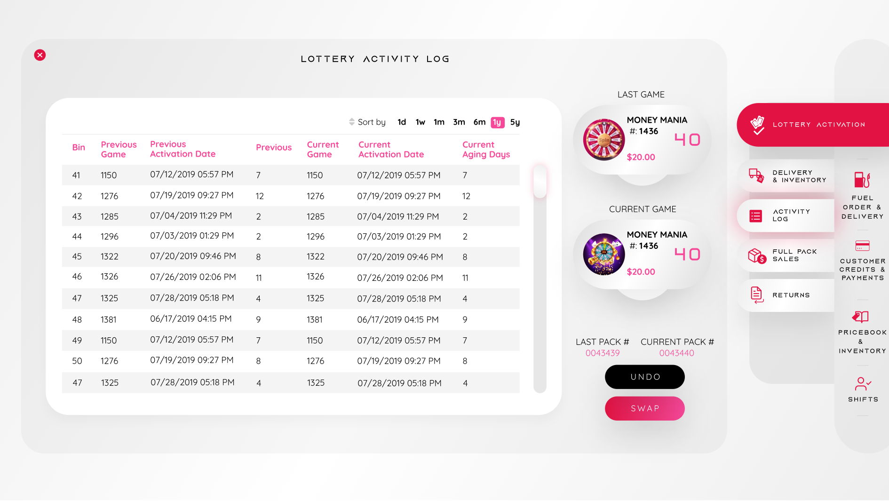
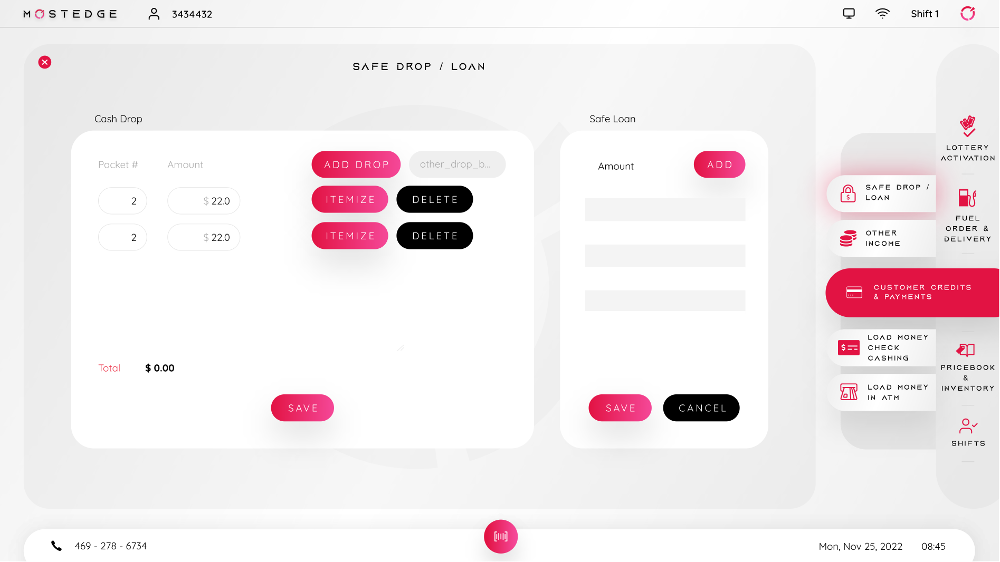

## Mostedge Agent

`07.2023 ~ 10.2023`

The Mostedge Agent Application stands as a comprehensive solution designed to bolster business operations within a shop environment. Developed using Windows Presentation Foundation (WPF), this multifaceted application seamlessly integrates key functionalities essential for managing diverse aspects of the business, ranging from Lottery Activation and Fuel Order and Delivery to Customer Credits and Payment, as well as PriceBook and Inventory management.

One of the standout features of the application is its versatile QR code scanning capability, facilitated through a dedicated device. This functionality streamlines processes such as inventory management, sales tracking, and customer engagement, providing a quick and efficient means of handling transactions and verifying product information.

In addition to transactional elements, the application boasts advanced features like chart drawing, allowing users to visualize and analyze data trends. The capability to customize tables provides a tailored approach to organizing and presenting data, enhancing the user's ability to glean valuable insights and make informed business decisions.

The Mostedge Agent Application further distinguishes itself by integrating map information management seamlessly. This feature is instrumental for businesses requiring geographical insights, aiding in route optimization for fuel delivery, location-based marketing strategies, and overall spatial awareness for effective decision-making.

Furthermore, the application seamlessly incorporates payment integration capabilities, streamlining financial transactions within the platform. This ensures a secure and efficient process for handling customer payments, contributing to a smoother overall business operation.

In summary, the Mostedge Agent Application, built with WPF, serves as a robust and integrated solution for businesses in a shop setting. From facilitating Lottery Activation to managing PriceBook and Inventory, the application's diverse functionalities cover the entire spectrum of operational needs. The incorporation of QR code scanning, chart drawing, table customization, map information management, and payment integration positions this application as a comprehensive tool, empowering businesses to optimize their processes, enhance customer experiences, and make informed decisions with ease.

#### Category

`Desktop` `Business` `WPF` `C#`

|    Technology    |    Client     |
| :--------------: | :-----------: |
| C#, WPF, Service | United States |

|  App  |                                  Link                                  |
| :---: | :--------------------------------------------------------------------: |
| video | https://drive.google.com/file/d/1Y_9W7qqJKtK0odATuv9EUFya9W-8mICS/view |

|              Images              |
| :------------------------------: |
|  |
|  |
|  |
|  |
|  |
