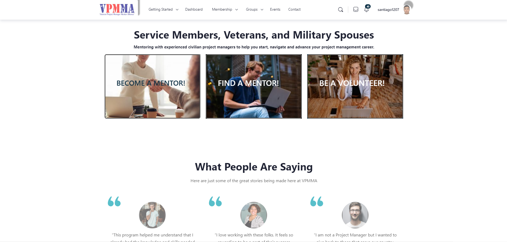
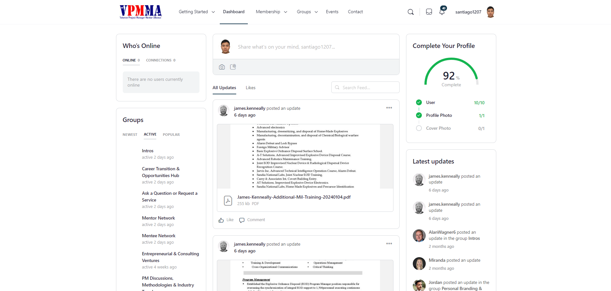
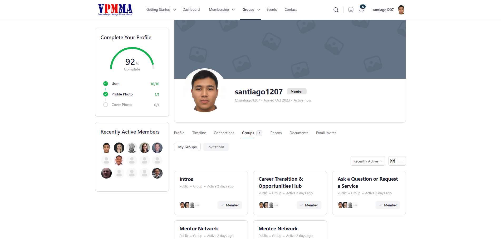
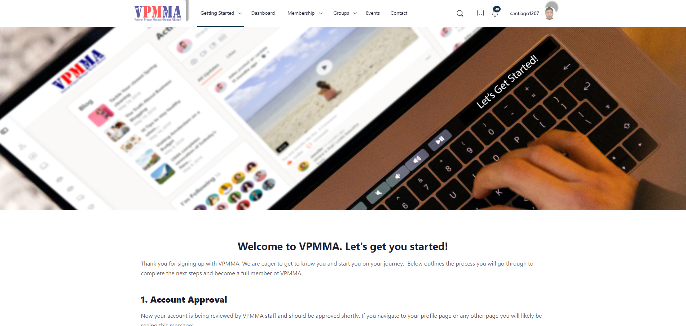

## VPMMA – The Veteran Project Manager Mentor Alliance!

`10.2023 ~ 12.2023`

VPMMA matches veterans and spouses with mentors and offers career development services at no cost. The VPMMA Board of Directors and its members are 100% volunteers dedicated to mission.

As the lead developer tasked with enhancing the VPMMA website, my primary responsibilities included the integration of new features and the customization of existing pages. A comprehensive research initiative was undertaken to gain proficiency in the BuddyBoss Plugin, coupled with mastering the intricacies of Elementor for seamless front-end improvements.

- Frontend Enhancement:
  Implemented a robust strategy to upgrade the frontend of the VPMMA website, ensuring a modern and user-friendly interface. Employed best practices in design and usability to elevate the overall user experience.

- BuddyBoss Plugin Integration:
  Conducted in-depth research on the BuddyBoss Plugin, successfully integrating its functionalities to enrich the social and community aspects of the VPMMA platform. This included optimizing member profiles and streamlining social interactions.

- Elementor Mastery:
  Became proficient in Elementor to masterfully customize pages, achieving a harmonious balance between aesthetics and functionality. This allowed for dynamic and visually appealing layouts that resonated with the website's target audience.

- Email Confirmation Workflow:
  Implemented a secure and efficient email confirmation system for users, enhancing account security and ensuring a seamless onboarding process. This feature significantly contributed to a positive user experience.

- User Profile Management:
  Developed and implemented robust functionalities for managing user profiles. This included user-friendly interfaces for users to update their information, enhancing engagement and personalization.

Successfully delivered a polished and upgraded VPMMA website that met and exceeded client expectations.
Received positive feedback on the improved user interface and the seamless integration of BuddyBoss and Elementor features.
Elevated the website's functionality with the implementation of user confirmation emails and enhanced profile management.

This project not only showcased technical expertise in frontend development but also demonstrated an adept ability to research and integrate third-party plugins for optimal website performance. The result is a VPMMA website that stands out for its modern design, enhanced functionalities, and improved user engagement.

#### Category

`WordPress` `Business` `Web`

|              Technology               |    Client     |
| :-----------------------------------: | :-----------: |
| WordPress, PHP, Html, CSS, JavaScript | United States |

| App | Link |
| :-: | :--: |

|           Images           |
| :------------------------: |
|  |
|  |
|  |
|  |
