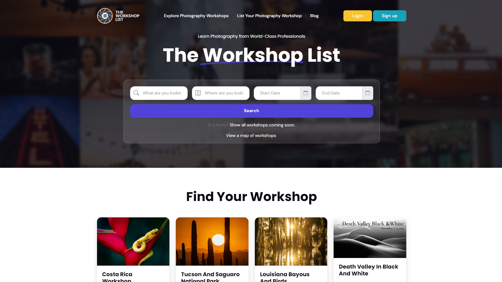
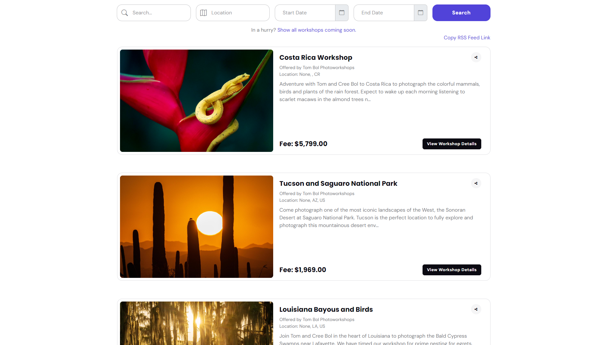
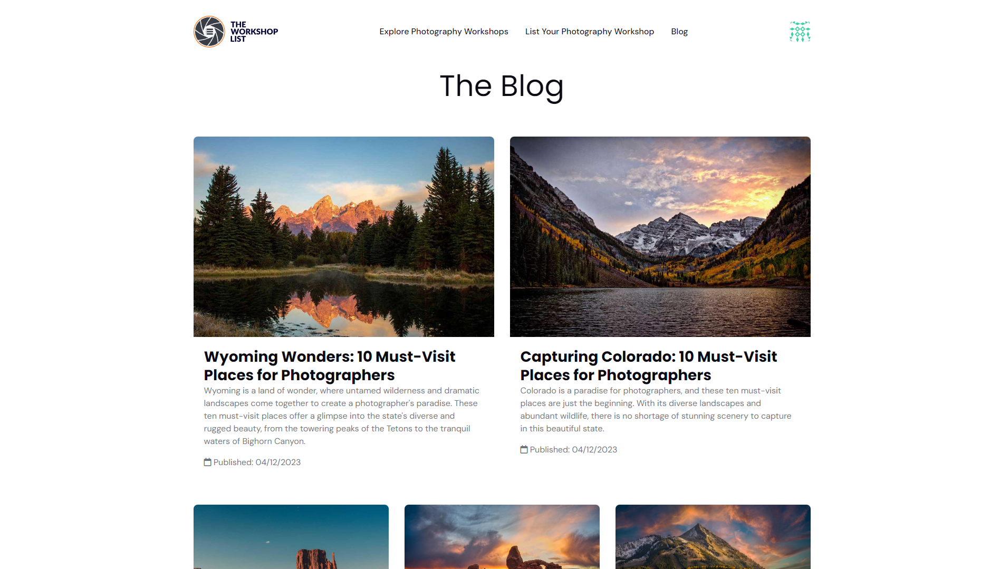
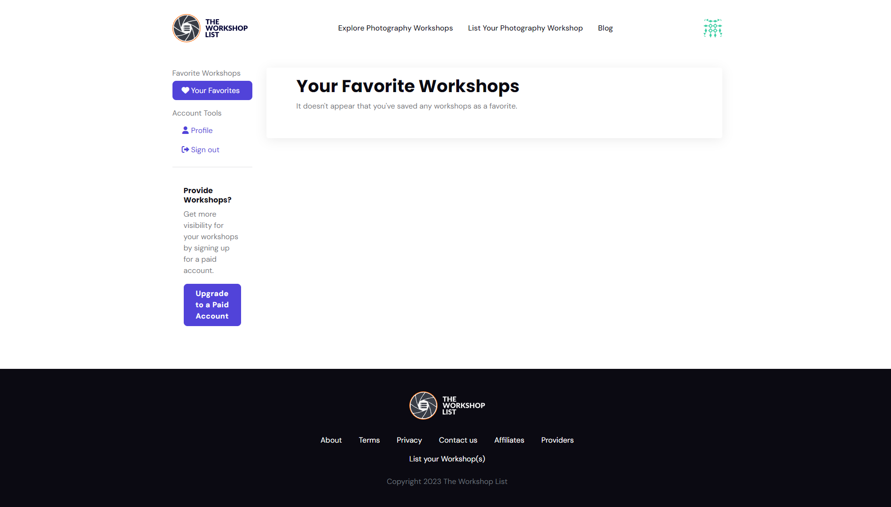

## The Workshop List

`04.2023 ~ 06.2023`

Successfully spearheaded the integration of innovative site sections and features, including a sophisticated workshop search and visually engaging workshop image galleries. Diligently addressed and resolved client concerns while seamlessly incorporating additional functionalities to enhance overall user experience. Executed a comprehensive refactor of the system, implementing robust full-stack features to elevate the platform's performance and functionality. Leveraging a keen eye for design, I meticulously redesigned and implemented various frontend areas, ensuring a polished and modern user interface. Through these initiatives, I significantly contributed to the project's evolution, delivering a seamlessly integrated, feature-rich, and aesthetically refined platform that meets and exceeds client expectations.

#### Category

`Web` `Django` `Business`

|              Technology              |    Client     |
| :----------------------------------: | :-----------: |
| Django, React, HTML, CSS, JavaScript | United States |

| App |             Link             |
| :-: | :--------------------------: |
| web | https://theworkshoplist.com/ |

|              Images               |
| :-------------------------------: |
|  |
|  |
|  |
|  |
